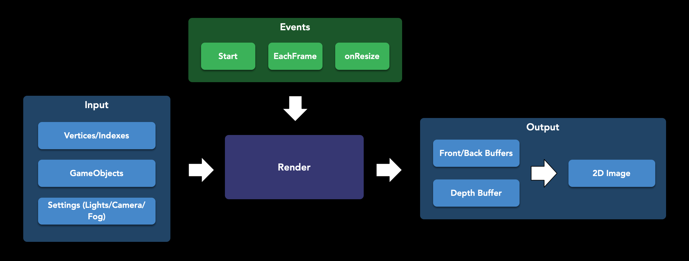
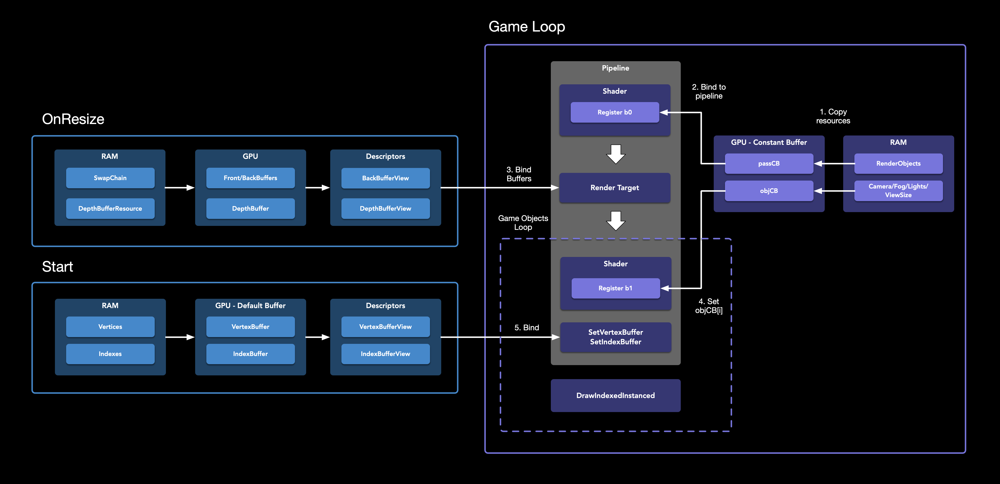

<p align="center"></p>


## プロジェクトについて

https://user-images.githubusercontent.com/6523886/212556269-de5021f2-1fbb-42fc-9c8d-89c1a612a29f.mp4

このプロジェクトは、C++ 11で書かれたレンダリングエンジンで、低レベルグラフィックスAPIとしてDirectX 12を使用しています。さらに、[ImGui](https://github.com/ocornut/imgui)ライブラリを採用し、様々なレンダリング機能をリアルタイムで設定するためのユーザーインターフェースを作成しました。当初は、エンティティ・コンポーネント・システム（ECS）としてヘッダオンリーライブラリの[EnTT](https://github.com/skypjack/entt)を導入していましたが、後によりシンプルなソリューションを自前で実装することにしました。

## インストール

ビルドツールとしてCMakeを使用しました。プロジェクトを実行するには、以下の手順に従ってください。

1.  リポジトリをクローンします。
    ```sh
    git clone [https://github.com/kovalgek/GameEngine.git](https://github.com/kovalgek/GameEngine.git)
    ```
2.  ルートディレクトリでスクリプトを実行します。
3.  生成されたプロジェクトファイルをVisual Studio 2019で開きます。

## ロードマップ

- [x] カスタムフォーマットの3Dオブジェクト
- [x] フォグ（霧）
- [x] ミラー（鏡面反射）
- [x] ライト（光源）
- [x] シャドウ（影）
- [ ] `.obj` 3Dファイル形式のサポート
- [ ] ネットワーク層
- [ ] Metalのような他のレンダリングAPIをサポートするための汎用レイヤー

## スキーマ（図）


#### データフロー

これは、どのデータやイベントがレンダリングを駆動するかを示す、簡略化されたデータフロー図です。

#### リソーススキーマ

これは、データがどの段階でどのようにレンダリングパイプラインにバインドされるかを示す詳細な図です。

## 謝辞

Frank Luna氏の著書[『Introduction to 3D Game Programming with DirectX 12』](https://www.amazon.com/Introduction-3D-Game-Programming-DirectX/dp/1942270062)が、このプロジェクトの開発において非常に役立ちました。彼のサンプルを単にコピーするのではなく、堅牢で優れた設計のアーキテクチャを持つゲームエンジンを作成することを目指しました。また、普段の仕事では主にSwiftとObjective-Cを扱っているため、C++でのプログラミングは新鮮な体験でした。